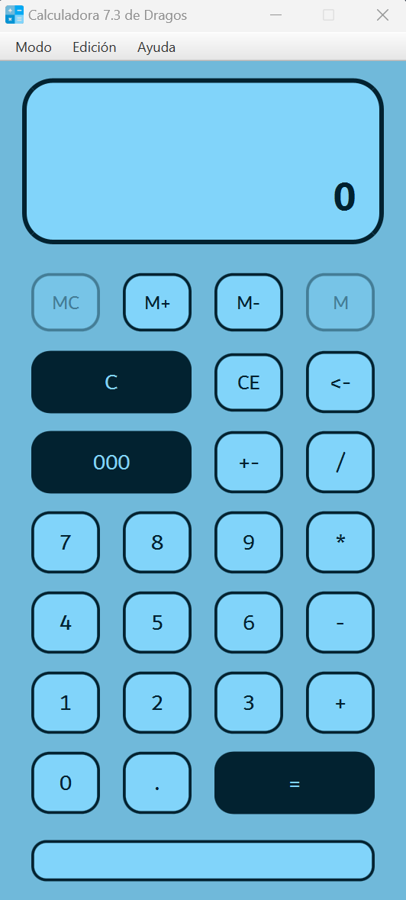

# Proyecto final D.I.: calculadora
## Propósito inicial
Este repositorio contiene el proyecto final de la asignatura Desarrollo de Interfaces del módulo Desarrollo de Aplicaciones Multiplataforma de la Comunidad de Madrid (IES María de Zayas y Sotomayor, 2023 - 2024). La idea era desarrollar una calculadora, siendo esto una excusa para aplicar y consolidar los conocimientos adquiridos en la asignatura y aprender a usar JavaFX con **IntelliJ IDEA** y **SceneBuilder**.

## Resultado
Se presenta una calculadora que abarca desde operaciones básicas hasta funciones científicas avanzadas, junto con una utilidad de conversión de divisas, longitud y tiempo. El enfoque principal ha sido garantizar la funcionalidad óptima del código y controlar todas las excepciones de manera adecuada. Además, la interfaz de usuario se ha diseñado usando **SceneBuilder** y **CSS** para ofrecer una experiencia intuitiva y coherente, manteniendo un diseño funcional y agradable.
### Calculadora básica
La calculadora básica es una herramienta fundamental en cualquier dispositivo electrónico o software. Su propósito principal es realizar operaciones matemáticas simples, como sumar, restar, multiplicar y dividir. Esta calculadora está diseñada para satisfacer las necesidades de cálculo cotidianas de los usuarios de manera rápida y eficiente.
La interfaz de la calculadora básica generalmente incluye un teclado numérico con botones para los dígitos del 0 al 9, así como botones separados para las operaciones básicas mencionadas anteriormente. Además, cuenta con una pantalla donde se muestran los números ingresados y el resultado de las operaciones.

### Calculadora científica
### Conversor de divisas, tiempo y longitud
