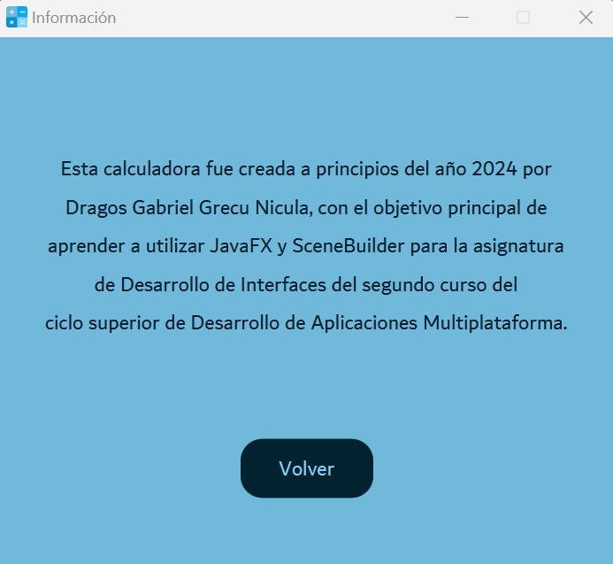
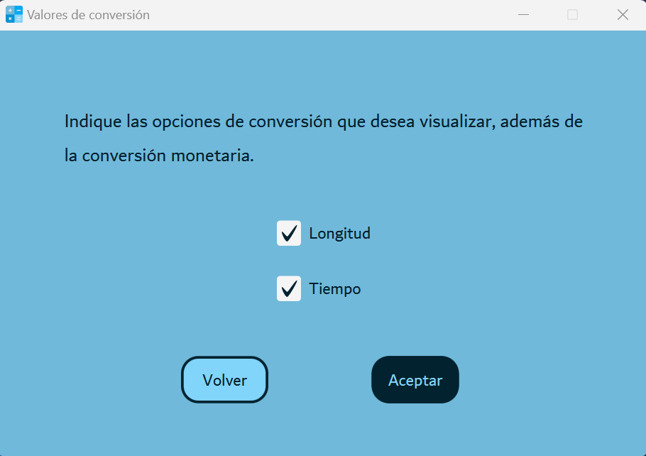

# Proyecto final D.I.: calculadora
## Propósito inicial
Este repositorio contiene el proyecto final de la asignatura Desarrollo de Interfaces del módulo Desarrollo de Aplicaciones Multiplataforma de la Comunidad de Madrid (IES María de Zayas y Sotomayor, 2023 - 2024). La idea era desarrollar una calculadora, siendo esto una excusa para aplicar y consolidar los conocimientos adquiridos en la asignatura, y aprender a usar JavaFX con **IntelliJ IDEA** y **SceneBuilder**.

## Resultado
Se presenta una calculadora que abarca desde operaciones básicas hasta funciones científicas avanzadas, junto con una utilidad de conversión de divisas, longitud y tiempo. El enfoque principal ha sido garantizar la funcionalidad óptima del código y controlar todas las excepciones de manera adecuada. Además, la interfaz de usuario se ha diseñado usando **SceneBuilder** y **CSS** para ofrecer una experiencia intuitiva y coherente, manteniendo un diseño funcional y agradable.
### Calculadora básica
La calculadora básica es una herramienta fundamental en cualquier dispositivo electrónico o software. Su propósito principal es realizar operaciones matemáticas simples, como sumar, restar, multiplicar y dividir. Esta calculadora está diseñada para satisfacer las necesidades de cálculo cotidianas de los usuarios de manera rápida y eficiente.
La interfaz de la calculadora básica generalmente incluye un teclado numérico con botones para los dígitos del 0 al 9, así como botones separados para las operaciones básicas mencionadas anteriormente. Además, cuenta con una pantalla donde se muestran los números ingresados y el resultado de las operaciones.

### Calculadora científica
La calculadora científica es una herramienta avanzada diseñada para realizar una amplia gama de operaciones matemáticas, incluidas funciones trigonométricas, exponenciales y logarítmicas. Su funcionalidad extendida la convierte en una herramienta indispensable para estudiantes, profesionales e investigadores en campos como la ingeniería, las ciencias naturales y las matemáticas.Es una herramienta esencial para resolver problemas matemáticos complejos, realizar análisis de datos y llevar a cabo experimentos científicos.

### Conversor de divisas, tiempo y longitud
El conversor es una herramienta que permite transformar unidades de una magnitud a otras de manera rápida y sencilla. En el contexto de esta aplicación, se incluye un conversor que abarca tres categorías principales: divisas, longitud y tiempo. Estas funcionalidades adicionales proporcionan una versatilidad extra a la calculadora, haciéndola útil en una variedad de situaciones cotidianas. Asimismo, es relevante apuntar que la conversión de divisas hace uso de la [API frankfurter](https://www.frankfurter.app/).

## Conclusión
En resumen, este proyecto de Desarrollo de Interfaces ha dado lugar a una calculadora versátil y funcional, complementada con un conversor que amplía aún más su utilidad en situaciones cotidianas. Esta aplicación ofrece una amplia gama de funcionalidades, desde operaciones básicas hasta funciones científicas avanzadas. Además, la cuidadosa atención prestada al diseño de la interfaz y al funcionamiento del código garantiza una experiencia de usuario intuitiva. En conjunto, este proyecto demuestra la aplicación exitosa de los conceptos aprendidos en la asignatura y ofrece una solución práctica y eficiente para las necesidades de cálculo y conversión en la vida diaria.
